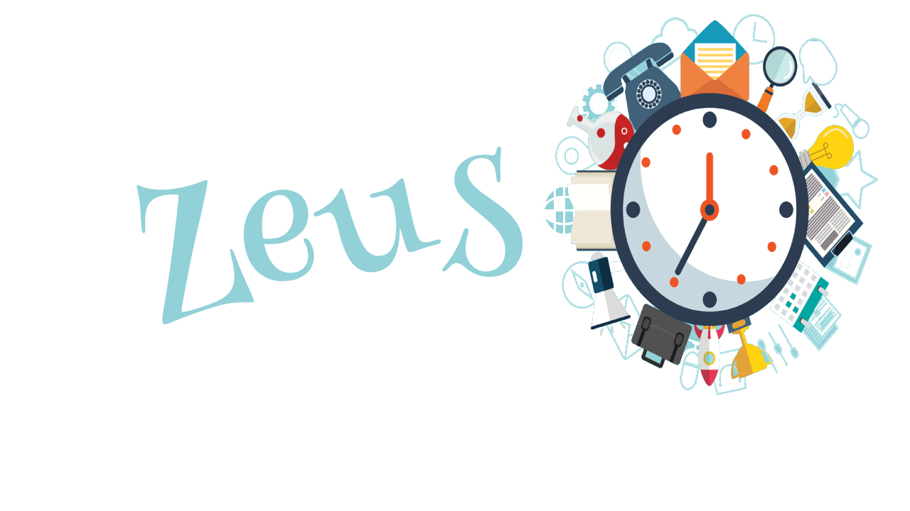

<p align="center">

</p>

    [](https://twitter.com/intent/follow?screen_name=nightwarrior_xx) [](https://telegram.me/nightwarrior_xxx)

## :ledger: Index

- [About](#beginner-about)
- [Usage](#zap-usage)
  - [Commands](#package-commands)
- [Development](#wrench-development)
  - [Pre-Requisites and Development Environment](#notebook-pre-requisites)
- [Community](#cherry_blossom-community)
  - [Contribution](#fire-contribution)
  - [Branches](#cactus-branches)
  - [Guideline](#exclamation-guideline)
- [Insights and Workflow](#beginner-insights)
- [Gallery](#camera-gallery)
- [Credit/Acknowledgment](#star2-creditacknowledgment)
- [License](#lock-license)

## :beginner: About

Zeus is a entry level management software, build basically for meetings.

## :zap: Usage

### :package: Commands

To start the projects you need to setup the development environment. Then run

```BASH
python3 manage.py runserver
```

## :wrench: Development

### :notebook: Pre-Requisites and Development Enviroment

- Install a virtual environment

```BASH
python3 -m venv <name of virtual env>
```

- Activate the virtual environment

```BASH
source <source folder>/<name of virtual env>/bin/activate
```

- Install requirements

```BASH
pip install -r requirements.txt
```

- Create a DB and User
```BASH
sudo su - postgres
psql
```
Now, we will create a DB for our App then a user which has privileges to access the DB
```
CREATE DATABASE myproject;
CREATE USER myprojectuser WITH PASSWORD 'password';
GRANT ALL PRIVILEGES ON DATABASE myproject TO myprojectuser;
```

- Now setup DB releated stuff in ```zeus/settings.py``` using environment variables.
- Make an account on **SendGrid**  and setup API_KEY again in the setting of the app.
- Create an account on **Twilio** as well. Generate a *Twilio Phone Number* and setup *AUTH_TOKEN*, *ACCOUNT_SID* and *PHONE NUMBER* in your app settings.


- Move into the source folder i.e zeus and run

```BASH
python3 manage.py makemigrations
python3 manage.py migrate
python3 manage.py runserver
```

## :beginner: Insights and Workflow

Once the host registers, the host then next has to Login to start the meeting. On logging in the a Guest CheckIn page will be there, where number of guests can checkIn. Suppose the guest checkedIn and meeting is over, it needs to fill a checkOut again to checkout, just to make sure no fake Guest can checkout.
At the Backend, once the Guest enters the information in the form, the backendb(**postgresql**) stores all of the information with time stamp of the entry. It also triggers an email(with help of **SendGrid**) and an SMS(with help of **Twilio**) to the host informing him of the details of the visitor. Also, it has a provision automatic checkout time. This also triggers an email to the guest which contains details of host(name) and guest.


## :cherry_blossom: Community

### :fire: Contribution

Your contributions are always welcome and appreciated. Following are the things you can do to contribute to this project.

1.  **Report a bug** <br>
    If you think you have encountered a bug, and I should know about it, feel free to report by making an issue and I will take care of it.

2.  **Request a feature** <br>
    You can also request for a feature. Just make an issue, and if it will viable, it will be picked for development.

3.  **Create a pull request** <br>
    It can't get better then this, your pull request will be appreciated.

### :cactus: Branches

I use an agile continuous integration methodology, so the version is frequently updated and development is really fast.

1. **`dev`** is the development branch.

2. **`master`** is the production branch.

**Steps to work with feature branch**

1. To start working on a new feature, create a new branch prefixed with `FEATURE` and followed by feature name. (ie. `FEATURE-<feature name>`)
2. Once you are done with your changes, you can raise PR.

**Steps to create a pull request**

1. Make a PR to `dev` branch.
2. Comply with the best practices and guidelines e.g. where the PR concerns visual elements it should have an image showing the effect.

After this, changes will be merged.

### :exclamation: Guideline

Make sure that there is only one extra line after the file ends and remember the indentation.


## :camera: Gallery

Pictures of project.

- Font Page
  

- Host Registration Page
  

- Host Login Page
  

- Guest Check In
  

- Guest Checkout
  

- Saved Guest Data
  

- Email Sent to Host
  

- SMS sent to Host
  

## :star2: Credit/Acknowledgment

Credits goes to me and other contributors

## :lock: License

[LICENSE](/LICENSE)
